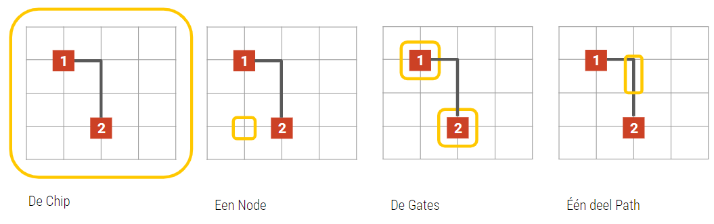
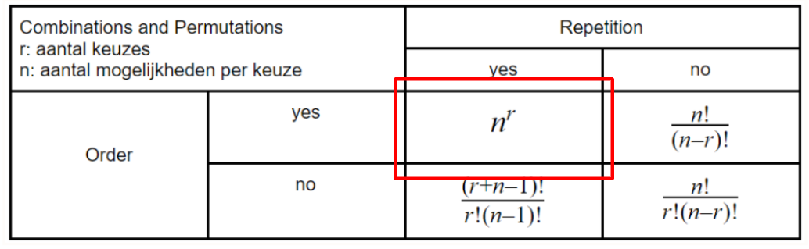
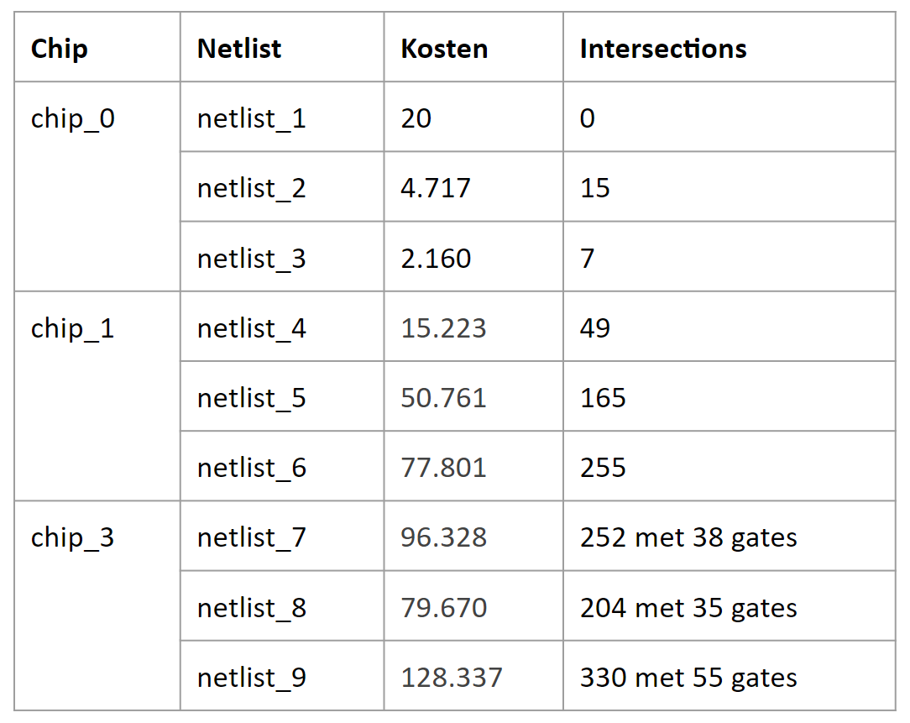
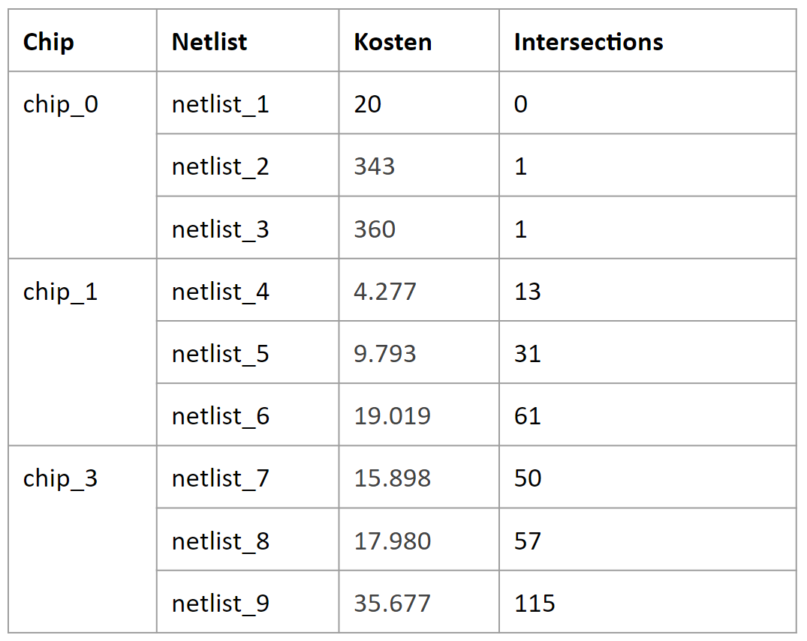
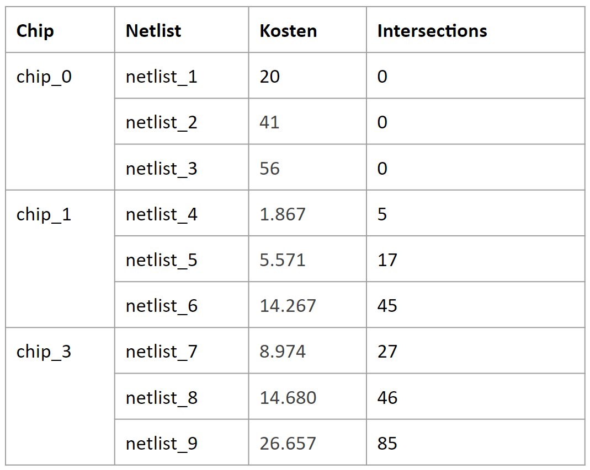
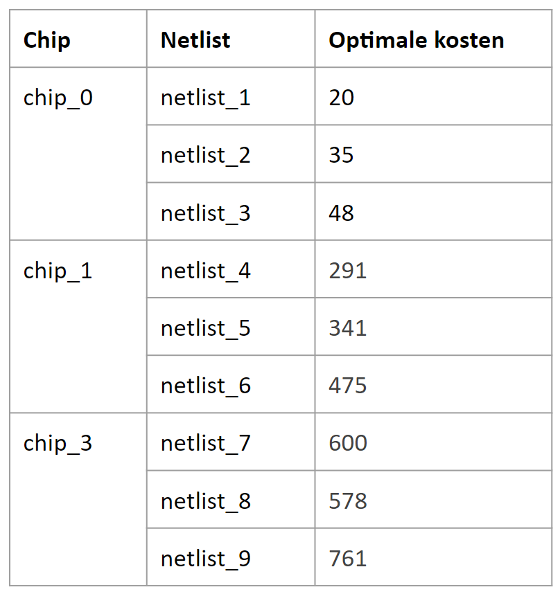

# Chips-Circuits

## Introductie
Voor de minor Programmeren aan de UvA hebben wij de opdracht gekregen om de paden tussen gates op een chip te optimaliseren. Op een chip zitten een aantal begin en eindpunten (ook wel gates genoemd) deze moeten op een een bepaalde manier met elkaar verbonden worden. De paden die hiervoor worden gebruikt moeten zo kort mogelijk worden, mogen niet dubbel gebruikt worden en mogen ook niet door andere gates heen gaan. Wel mogen deze paden kruisen en de over elkaar heen gaan.

Om de case goed te begrijpen zijn de gebruikte termen hieronder uitgelegt.

<br />
De locaties van de gates en de volgoorde van het leggen van de paden zijn gegeven. In de [data folder](data) zijn de verschillende chips met bijbehorende netlists (lijsten met de volgoordes van het leggen van de paden) te vinden. Per chip zijn er 3 van deze netlist gegeven. Om te kunnen berekenen of een oplossing beter is dan een andere oplossing is er ook een formule gegeven voor de kosten van de oplossing.

```C = n + k * 300``` 
<br />Hierin is **C** de totale kosten, **n** het aantal stukjes pad wat is gelegd en **k** het aantal kruisingen, deze zijn dus wel toegestaan maar krijgen extreem veel strafpunten. Het doel is dus om zo min mogelijk kosten te maken.

## State Space
Zonder een oplossing te hebben gemaakt hebben wij een inschatting gemaakt van de State Space van deze case. 
Aangezien de chip een grote heeft van 15 x 16 x 8 heeft 1920 nodes, op elke node kan wel of geen pad worden gelegd. Hierdoor hebben we 1920 keuzemomenten met twee keuzes, hiervan is de volgoorde belangrijk. <br />
 
<br />Met deze formule zijn wij op een State Space van 2^1920 gekomen. 

## BaseLine
Voor de BaseLine hebben wij een Greedy geschreven aangezien het random leggen van paden niet op een antwoord zou uitkomen. In ons Greedy algoritme hebben bekijken we welke volgende stap van het pad het dichts bij het eindpunt ligt. 

**Werking**<br />
Voor het runnen van het Greedy algoritme moet je deze activeren in de main.py<br />
```python3 main.py {de gewenste chip} {de gewenste netlist}```
<br />
Wanneer dit gerunt wordt ontstaat er een output file en de daarbij horende representatie. 

### Uitkomsten

<br />
De scores die uit de baseline komen zijn nog niet valide. Dit komt doordat de intersections niet op een geldige manier worden gebruikt. Het kan zo zijn dat ze pad stukken dubbelbezetten. Ook is er te zien dat bij chip_2 er nog gates worden gebruikt om paden te kunnen leggen. Om te zorgen dat dit zo min mogelijk gebeurd hebben we hier wel een kosten van 500 aangegeven. 

## Algoritme 1
Aangezien onze Baseline nog niet voor alle chip valide uitkomsten genereerde zijn wij overgestapt naar een A* algoritme, 

**Werking**<br />
Voor het runnen van het A* algoritme moet je deze activeren in de main.py<br />
```python3 main.py {de gewenste chip} {de gewenste netlist}```
<br />
Wanneer dit gerunt wordt ontstaat er een output file en de daarbij horende representatie. Dit algoritme zorgt dat de uitkomt altijd het zelfde is.

### Uitkomsten

<br />
Bij de Baseline waren de uitkomsten nog niet valide door het dubbel gebruiken van paden en door het gebruiken van gates in de paden. De uitkomsten van de A* zijn wel allemaal valide. Ook zijn ze ten opzichte van de Baseline vlink verbeterd.  

## Algoritme 2
De eerder gemaakte A* hebben wij voor het tweede algoritme gebruikt om een Hill Climber op te zetten. Hierin wordt de volgoorden van de netlist gesuffeld en vervolgens worden er in de beste netlist steeds kleine aanpassingen gemaakt om nog beter te worden.

**Werking**<br />
Voor het runnen van het Hill Climber algoritme moet je deze activeren in de main.py <br />
```python3 main.py {de gewenste chip} {de gewenste netlist} {het aantal restarts} {het aantal keer verbeteren}```
<br />
Als uitkomst krijg je dan de beste gevonde uitkomt met de daarbij horende output file en representatie. Deze uitkomst is niet altijd dezelfde uitkomst, dit komt doordat de volgoorde van de netlist random gekozen worden. 

### Uitkomsten

<br />
De Hill Climber gebruikt het A* algoritme wat er voor zorgt dat alle oplossingen valide zijn. Door het toepassen van een Hill Climber op de volgoorde van de netlist kunnen we betere scores halen. De scores die zijn weer gegeven bij een begin populatie van 20 en het 20 keer verbeteren van de beste 5. 

## Experiment
Wij hebben drie experimenten uitgekozen om te onderzoeken. Deze zijn:
1. Het swappen van mindere onderdelen in de netlist inplaats van 1 net naar voren te plaatsen
2. Met het huidige algoritme hadden wij gekozen dat de beste 5 door gingen naar de "volgende ronde". Deze parameter hebben wij voor een experiment verhoogt en verlaagt.
3. Ook zijn we gaan kijken wat het invloed is als de aantal restarts en het aantal herhalingen groeit. 
4. Als laatste hebben wij toegevoegd dat hoe hoger het pad gaat hoe goedkoper het leggen van een pad is. 

**Experiment 3**
<br />
Wij hebben voor chip 1 en 2 gekeken wat het veranderen van het aantal restarts en het aantal herhalingen doet op de uitkomst. Hieruit blijkt dat hoe meer restarts je doet hoe meer kans op een betere oplossing. Dit is ook goed te verklaren aangezien de restart random volgoordens van netlists zijn. Dus hoe meer verschillende volgoordens hoe meer kans op een volgoorde die bij een goede score past.
Wel hebben we ook gemerkt dat er na een hoeveelheid restarts de uitkomsten niet meer groot veranderen. 

**Optimale paden**
<br />
Wanneer elk pad zonder onderbrekingen kan worden neergelegd komen de volgende scores uit de chips en netlists: 
<br />
| Chip  | Netlist   	| Optimale kosten | Kosten uit laatste experiment |
| ----- | ------------- | --------------- | ----------------------------- |
| _0    | netlist_1     | 20              |                               |
| _0    | netlist_2     | 35              |                               |
| _0    | netlist_3     | 48              |                               |
| _1    | netlist_4     | 291             |                               |
| _1    | netlist_5     | 341             |                               |
| _1    | netlist_6     | 475             |                               |
| _2    | netlist_7     | 600             |                               |
| _2    | netlist_8     | 578             |                               |
| _2    | netlist_9     | 761             |                               |


